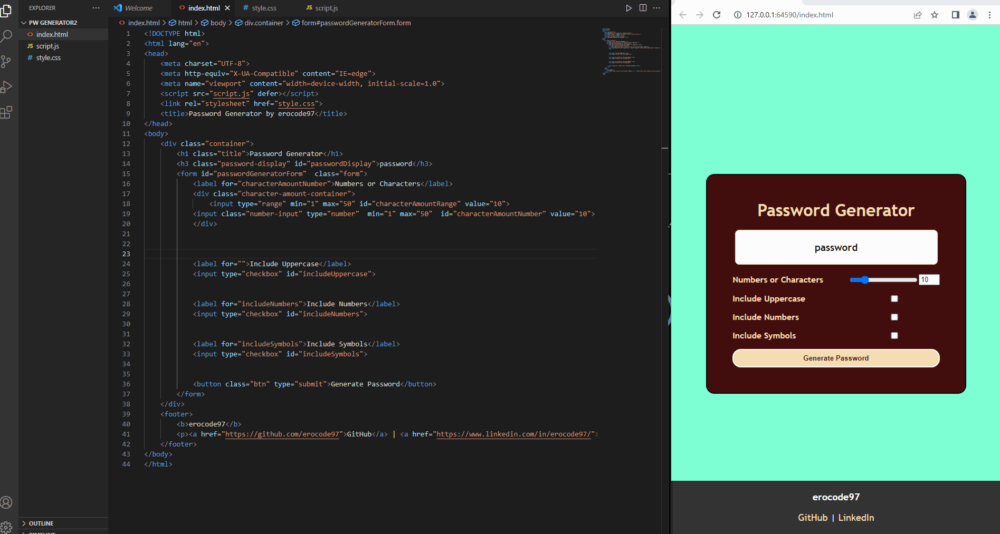

<h1>
 Password Generator
</h1>
<b style="color: #FF7A59">
Password Generator is a tool developed using Javascript and CSS. The program offers users the ability to generate random passwords up to 50 characters long with options for uppercase letters, symbols, and numbers. This allows users to protect their online accounts by creating secure passwords.  
---------------------------- 
Password Generator adlı program, Javascript ve CSS kullanılarak geliştirilmiş bir araçtır. Program, kullanıcılara büyük harf, sembol ve sayı seçenekleri ile 50 karaktere kadar rastgele parolalar oluşturma imkanı sunar. Bu sayede kullanıcılar güvenli parolalar oluşturarak çevrimiçi hesaplarını koruyabilirler.
<b>

<h1>Used Technologies </h1>
<ul>

<h1>
 Preview 🎥
</h1>

